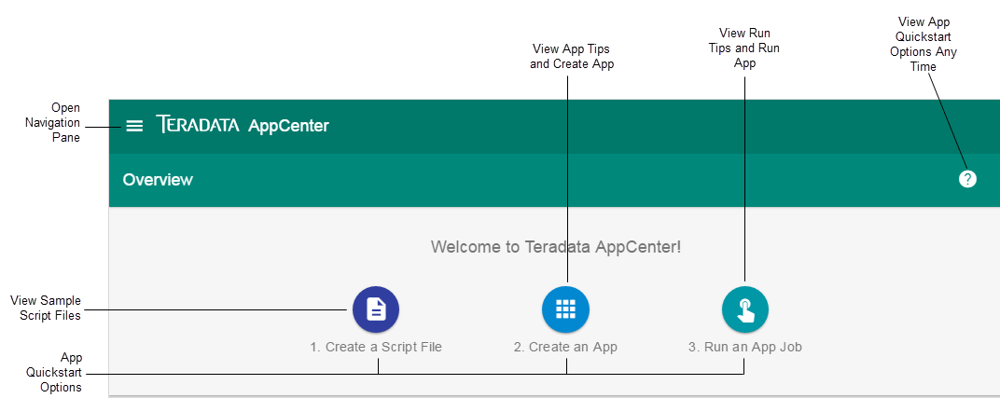

You can create SQL, BTEQ, or Java apps from the Dashboard or [Manage Apps](managing-apps.md) view. 

If you have not created any apps yet, AppCenter displays quickstart buttons at the top of the Dashboard for a guided approach with your first app, including sample SQL, Java, and BTEQ script files you can download. One you create apps, you can access the quickstart options by clicking  in the top-right corner.

 

1. From the **Dashboard** or **Manage Apps** view, click . 
2. In the **App Info** card, complete the entries with the following considerations:
  * Once you save the **App Info** card, you cannot change the **App Type**.
  * Use the default **Memory**, **Processors**, and **CPUs** values, unless you encounter errors that indicate resources are limited after running the app.
3. Click **Save** to proceed to the **App Code** card.
4. In the **App Code** card, do one of the following:
  * Click **Choose a File**, select the code file, and when the name of the file appears on the button, click it.
  * Drag the code file on top of the **Choose a File button**, and when the name of the file appears on the button, click the button.
5. [Optional] In the **App Configurations** card, do the following to pass paraemeters to the app:
  6. Click **Add Field**, click **(text field)**, and complete the entries. 
  7. If you want this field to be required when the app runs, which means the app will fail if this information is not present, click the slider next to **Required**. Click it again to remove the requirement.
  8. Repeat these steps to add additional parameters.
  9. Click **Save & Continue**.
 
  **Note**:  To skip this section, click either **AppResults Configurations** or **App Permissions**.
 
10. [Optional] In the **App Results Configurations** card, do the following to generate a visualization for this app:
   11. Click **Add Field**, click **(name)**, and complete the settings. 
   12. Repeat these steps to add additional settings.
   12. Click **Save & Continue**. 
 
  **Note**:  To skip this section, click **App Permissions**.

14. [Optional] In the **App Permissions** card, do the folowing to change the defaults:
   12. To add additional Managers, begin typing the user name, click it, and then press **Enter**. Repeat this step for each additional user you want to be a Manager for the app.
   13. To make this app public instead of private, click the slider next to **Privacy On**. Click it again to make this app private again.
   14. To add additional users to a private app, click the line below **Private users**, type the name of the user, and then press **Enter**. Repeat this step for each additional user you want to be a Private user.
15. Click **Save & Continue**.
16. Do one of the following:
   17. To run the app now, do the following:
      18. Click **Run App**.
      19. Select a system and enter the credentials.
      20. If you entered parameters for this app, click **Continue** to use them for this job run, or click **Clear** if they are not required parameters and you don't want to use them for this run.
      21. [Optional] Select **Schedule** options. and select **Daily** or **Advanced** run times.
      22. Click **Run Now**.
      
   18. To review the app, click **View App** and then click .

## Related Topics
* [App Results Configurations Formats and Types](app-results-configuration-formats.md)
* [Running an App](running-app.md)
* [User Roles, App Permissions, and Job Results Permissions](app-permission-user-role.md)
