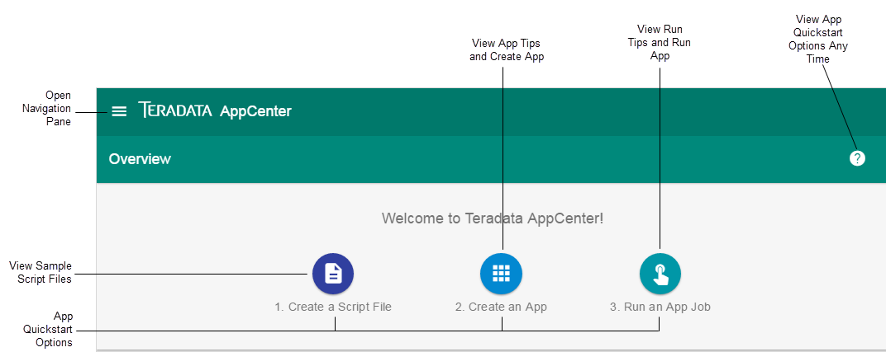

Depnding on user role and app status, AppCenter displays one of the following in the **Overview** (Dashboard) when you log in:

| User Role          | App Status          |  Display    |
| ------             | -----------         |  ---------  |
| User or Admin      | No apps created yet |  Welcome quickstart card to guide you through app creation       |
| User or Admin      | Apps created |  16 most recently created apps, apps you can manage, and recent job results       |
| User or Admin      | Any | Create app button ()       |
| Root User          | Not applicable |  LDAP settings       |

## Welcome Quickstart Card

 

To return to the Dashboard from any view, do the following:

1. In the upper-left corner, click  and then click **Overview**.

## Related Topics
* [User Roles, App Permissions, and Job Results Permissions](app-permission-user-role.md)
* [Admin Guide](../admin-guide/index.md)
